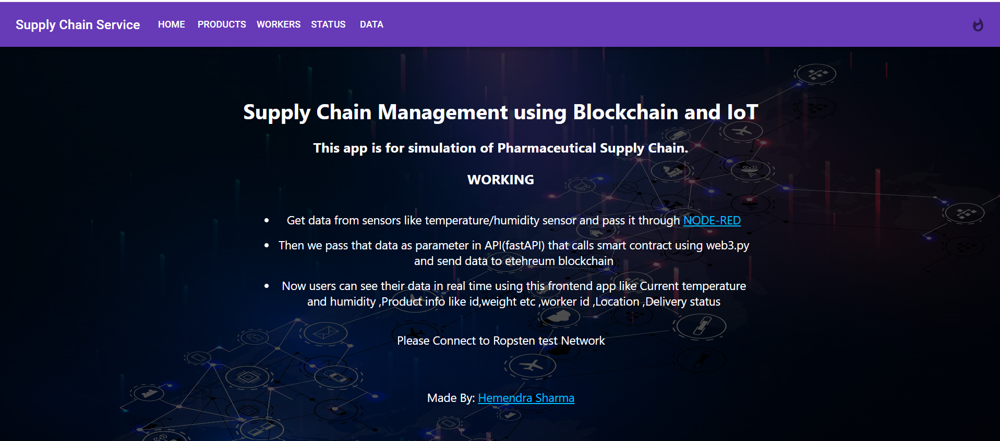
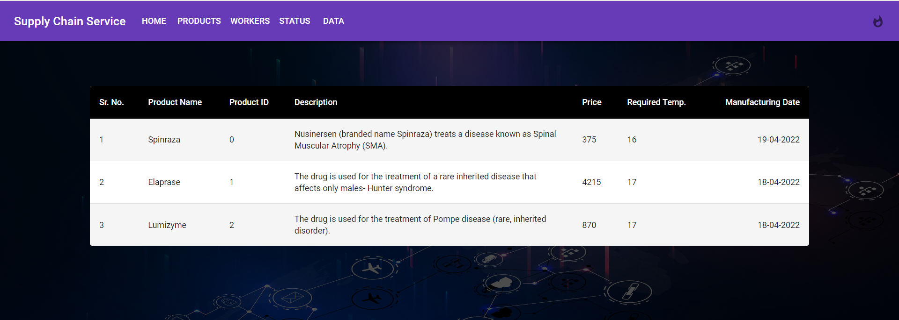
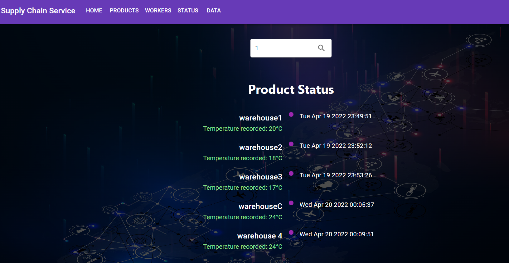

Smart Contract based Supply Chain Management for Data Integrity and Anti-Tampering.
## Ropsten testnet is depricated so please use goerli network!!!

 SMART CONTRACT -->  https://ropsten.etherscan.io/address/0xE4b876ed393E19FbD18eC99118647BcbFE5300F3#code 

 Frontend link  --> https://psupplychain.netlify.app/ 

<h3> Tech Stack </h3>
<ul>
  <li>Blockchain --> Ethereum, Solidity and hardhat </li>
  <li> IOT --> Arduino , DHT11 sensor  and Node red </li>
  <li> Backend --> Fastapi </li>
  <li> Frontend --> Reactjs and Ethers.js </li>
</ul>

# How to run 

## 1.Run every service seperately

## Project is divided into three parts i.e  client(frontend) , backend and IOT 

### Backend

- So first setup metamask wallet and enable testnet
- get some test ethers from this [webiste](https://mumbaifaucet.com/)
- now deploy this contract to polygon mumbai testnet via remix ide or hardhat or using any other tool . [This](https://wiki.polygon.technology/docs/develop/remix/) might help
- go to alchemy.com and create a app and select mumbai testnet and get the key it will look like this --> `https://polygon-mumbai.g.alchemy.com/v2/<your_key>`
- Then go to contract.py on line 9 you see w3 so change the url there 
- after that change the account address ,key(private_key) and contract address in contract.py
- `key = '<account-private-key>' `
- `account = w3.toChecksumAddress('<your-account-address>')  `
- `address = w3.toChecksumAddress('<contract-address>')`
- then run this command `pip install -r requirements.txt` (its better if you create virtual environment)
- now everything is done so just run this command `uvicorn main:app --reload` this will start the backend server
- Now go to `http://localhost:8000/docs` and add workers,products and status etc

### Client/Frontend

- Go to client folder and run this command `npm install`
-  Then go to componenst folder which is inside client folder and change contract address which is there 4 display file
- its like `const ContractAddress = '<your_contract_address>' `
- you can change contents of home page by editing home.js file 
- now everything is done you can run the command `npm start`
- now your app is runnng on port 300

### IOT 

- setup dht11 with arduino [LINK](https://randomnerdtutorials.com/complete-guide-for-dht11dht22-humidity-and-temperature-sensor-with-arduino/)
- setup node red --> so basically node red is low code programming for event driven applications
- so here we send data from arduino to com3 port and we setup a node at com3 port in node red (in built node) that collects data and from there we can modify or add data according to our needs and calls an API that will send our data to blockchain 
- json file for flow is [here](https://github.com/HemendraSharma04/SupplyChainDapp/blob/hemendra/Node_Red.json) , you just need to go to node red settings and click on import flows or similar option that will import this flow to your node red and then you can see the code there and change it (its basically plain js code)

## 2.Docker

- install docker and change contract address and other variables 
- run the command `docker-compose up`
- Thats it 😎🚀

# SCREENSHOTS

HOME PAGE 

PRODUCTS PAGE

STATUS PAGE

DATA PAGE

